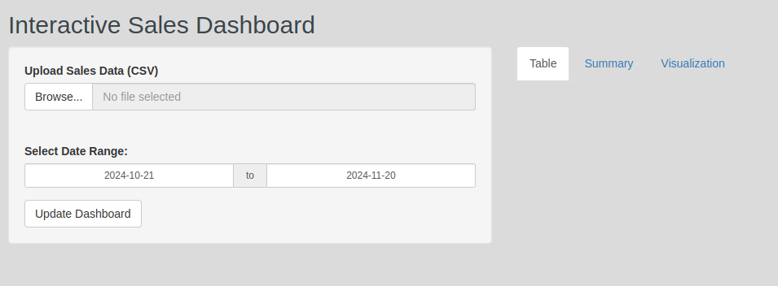

# Interactive Sales Dashboard

This project is an **Interactive Sales Dashboard** built using the R Shiny framework. It allows users to upload sales data, filter and explore it dynamically, view summary statistics, and visualize trends through interactive charts.

## Features

- **File Upload**: Upload CSV files containing sales data.
- **Dynamic Filters**: Filter data by region and date range.
- **Data Table**: Display the filtered data in an interactive table.
- **Summary Statistics**: View key metrics like total sales and transactions.
- **Visualization**: Interactive line plot to visualize sales trends.

## Demo



## Installation

1. **Clone this repository**:
   ```bash
   git clone https://github.com/themispap/interactive-sales-dashboard.git
   ```
   
2. **Navigate to the project directory**:
   ```bash
   cd interactive-sales-dashboard
   ```

3. **Install dependencies**:
   Open R or RStudio and install the required R packages:
   ```R
   install.packages(c("shiny", "DT", "dplyr", "ggplot2"))
   ```

4. **Run the app**:
   Open `app.R` in RStudio and click the **Run App** button, or use the following command (making sure setting as working directory the directory of the app.R file):
   ```R
   shiny::runApp()
   ```

## How to Use

1. Upload a CSV file with the following columns:
   - `Date`: The date of the transaction (e.g., "2024-01-01").
   - `Sales`: The sales amount for the transaction.
   - `Region`: The region where the transaction occurred.

2. Use the sidebar to:
   - Filter by region (select one or multiple).
   - Select a date range for filtering.

3. Explore the outputs:
   - **Table Tab**: View the filtered data in a table.
   - **Summary Tab**: See key metrics such as total sales and transactions.
   - **Visualization Tab**: View trends in sales with a dynamic line plot.

## File Structure

```
interactive-sales-dashboard/
│
├── app.R              # Main Shiny app script
├── README.md          # Project documentation
└── example_data.csv   # Example CSV file for testing
```

## Example CSV File

Here’s an example of the expected CSV structure:


| Date       | Sales | Region      |
|------------|-------|-------------|
| 2024-01-01 | 500   | North       |
| 2024-01-02 | 700   | South       |
| 2024-01-03 | 300   | East        |


## Contributing

Contributions are welcome! If you have ideas for new features or bug fixes, feel free to fork this repository and submit a pull request.

## License

This project is open-source and available under the MIT License.

## Acknowledgments

- Built with [R Shiny](https://shiny.rstudio.com/).